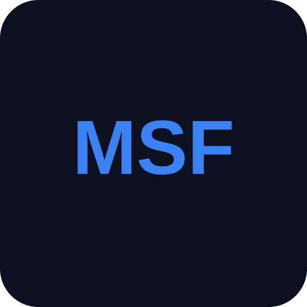

# The MSF Toolkit

<p align="center">
  
</p>

<p align="center">
  A mobile-first command center for Marvel Strike Force players.
</p>

<p align="center">
  <a href="https://themsftoolkit.com"><strong>Open The MSF Toolkit</strong></a>
  ·
  <a href="msf-companion/README.md">Developer setup</a>
  ·
  <a href="msf-api/msf-api-undocumented.md">MSF API research</a>
</p>

The MSF Toolkit turns a commander's live Marvel Strike Force account data into useful, personalized planning tools. Sign in with Scopely to inspect your roster, decide what to build next, prepare for events and endgame modes, compare teams against the current meta, and get advice grounded in both official game data and current community knowledge.

This repository contains the production application, its Azure infrastructure, an MSF API reference archive, and the internal automation used to develop and operate the toolkit.

> The MSF Toolkit is an independent community project. It is not affiliated with, endorsed by, or sponsored by Scopely or Marvel.

## What the toolkit does

### Command Center

- Personalized dashboard with roster progress, farming priorities, active events, offers, and meta snapshots
- Daily briefing that brings the most useful actions into one view
- Installable mobile PWA with notifications and a compact, touch-first interface

### Roster and team planning

- Live roster browser with power, gear, stars, traits, ISO-8, and character details
- Team builder with roster-aware composition and synergy information
- Progress snapshots for tracking account growth over time

### Investment planning

- Upcoming-event readiness and roster-gap analysis
- Upgrade cost calculations using live MSF game data
- Commander Wallet for manually tracking Gold and Power Cores
- Cost-versus-wallet answers that show whether an upgrade path is affordable and what is missing
- Farming recommendations tied to roster and event needs

### Fight analysis

- Dark Dimension planning and team recommendations
- Tower event detection, room requirements, opponent-aware scoring, safety margins, and team allocation
- Time Heist and Upgrade Token build guides
- War and Cosmic Crucible meta comparisons against the commander's actual roster

### AI roster advisor

- Personalized answers based on roster snapshots
- Knowledge drawn from official game data, official blogs, and monitored community creators
- Source citations, confidence scoring, conversation history, and feedback
- Automated knowledge-gap detection and refresh workflows

## How it fits together

```text
Scopely OAuth + MSF API
          │
          ▼
Next.js application and route handlers ─────► PostgreSQL / Prisma
          │                                      account state,
          │                                      snapshots, plans
          ▼
Azure AI Search ◄──── Cosmos DB ◄──── Azure Functions
          │              ▲             game data, blogs,
          ▼              │             Reddit, YouTube
   Azure OpenAI ──────────┘
   personalized advisor
```

The browser never receives the MSF API key or Scopely client secret. Player-specific requests use the commander's OAuth session on the server, while game-wide ingestion jobs use server credentials.

## Repository map

| Path | Purpose |
|---|---|
| [`msf-companion/`](msf-companion/) | The production Next.js PWA, route handlers, domain logic, tests, Prisma schema, Azure Functions, and infrastructure |
| [`msf-api/`](msf-api/) | Official OpenAPI snapshots plus live-probed and community-discovered MSF API behavior |
| [`tasks/`](tasks/) | Product requirements and feature research used to plan toolkit improvements |
| [`.github/`](.github/) | Deployment, knowledge-refresh, and story-development automation |
| [`AGENTS.md`](AGENTS.md) | Repository guidance for coding agents and contributors |

## Technology

| Layer | Technology |
|---|---|
| Application | Next.js 16, React 19, TypeScript, Tailwind CSS |
| Authentication | Scopely OAuth 2.0, PKCE, encrypted `iron-session` cookies |
| Data | PostgreSQL, Prisma, Azure Cosmos DB |
| Intelligence | Azure OpenAI, Azure AI Search, YouTube/community ingestion |
| Payments and messaging | Stripe, Resend, Discord, web push |
| Hosting | Azure Container Apps, Azure Functions, Bicep, Azure Developer CLI |
| Testing | Vitest and Playwright |

## Local development

The application lives in `msf-companion/`.

### Prerequisites

- Node.js 20+
- PostgreSQL
- A Scopely OAuth application and MSF API key
- Optional Azure, Stripe, Resend, Discord, and YouTube credentials for the features that use them

### Start the app

```powershell
cd msf-companion
npm install
Copy-Item .env.example .env
npx prisma generate
npx prisma migrate dev
npm run dev
```

Open [http://localhost:3000](http://localhost:3000). Configure `.env` before attempting Scopely login or any integration-backed feature. See the [application README](msf-companion/README.md) for the environment-variable map, validation commands, and deployment notes.

## Development workflow

Product work is organized as small, testable user stories. This repository still contains the Ralph/Copilot automation it originally grew from, but that automation is development infrastructure—not the product.

- PRDs live under `tasks/`
- `prd.json` records the active implementation plan
- `progress.txt` preserves codebase patterns between automated iterations
- `.github/agents/` and `.github/skills/` contain the internal agent workflows

## License

The repository is available under the [MIT License](LICENSE).
